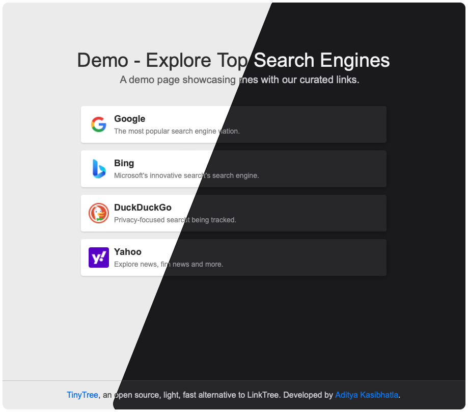

# TinyTree
Tinytree is the smallest, most performant linktree alternative.

It uses a config file to generate static HTML files for every page of links.

## Features
- Tiny: Entire script fits in a single file (<150 lines) with no dependencies
- Fast: Generates static HTML files for every page of links
- Customizable: Use your own CSS and HTML templates
- Easy to use: Just edit the config file and run the script
- Serverless: No need to host a server or database. Point your domain or subdomain to public/ and you're done
- SEO friendly: Generates static HTML files with meta tags for each link
- Analytics and more: Add Google Analytics or other tracking code to the template HTML file or to the scripts.js file

## Usage
1. Clone the repo
2. Edit the config file. (Example: `templates/config.json.example`)
3. Run the script with `python3 main.py`
4. Point your domain or subdomain to the `public/` directory

## Config file
See `templates/config.json.example` for an example config file.

The config file is a JSON object with the following keys:
- public_folder: The folder where the static HTML files will be generated
- default_css: The default CSS file to use for all pages that don't specify a CSS file
- pages: An object that defines every page (or tree). Each page is an object with the following keys:
  - title: The title of the page
  - subtitle: A subtitle for the page
  - seo_keywords: An array of keywords for SEO
  - css: The CSS file to use for this page (optional)
  - links: An object with keys for each link. Each link is an object with the following keys:
    - title: The title of the link
    - subtitle: A subtitle for the link
    - url: The URL of the link

## Custom CSS and HTML templates
- Find all the templates in the `templates/` directory.
- You can use your own CSS and HTML templates by editing the `boiler-main.html` and `boiler-link.html` files.
- Add any custom CSS to the `main.css` file or create your own CSS file and reference it in the config file.
- You can also add custom JavaScript to the `scripts.js` file. The scripts are appended to the end of every file.
- It is recommended to keep all the files in the `templates/` directory and reference them in the config file.

## License
MIT License
